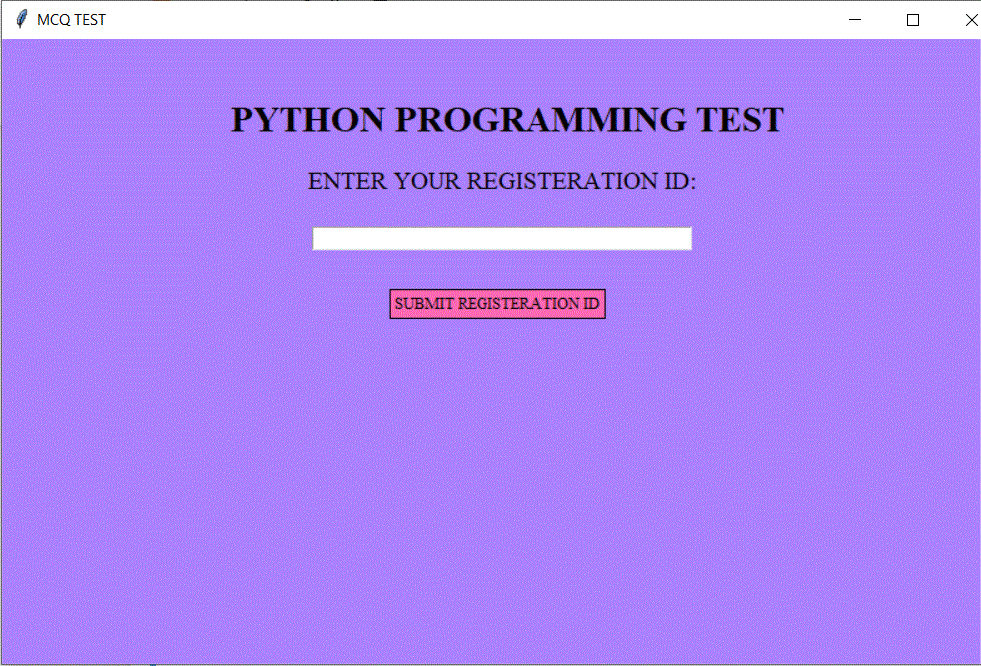
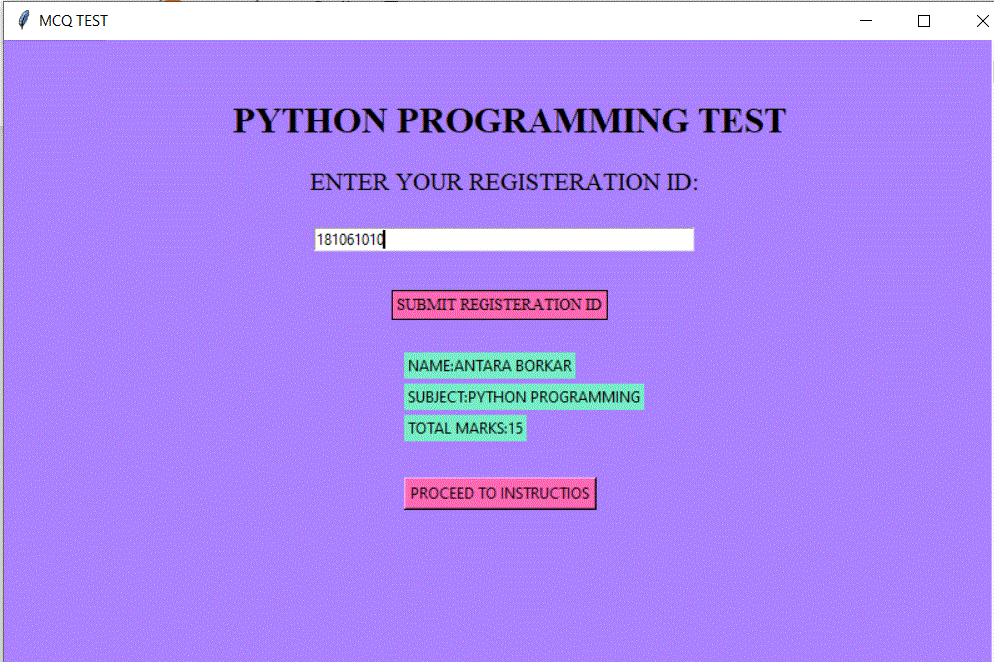
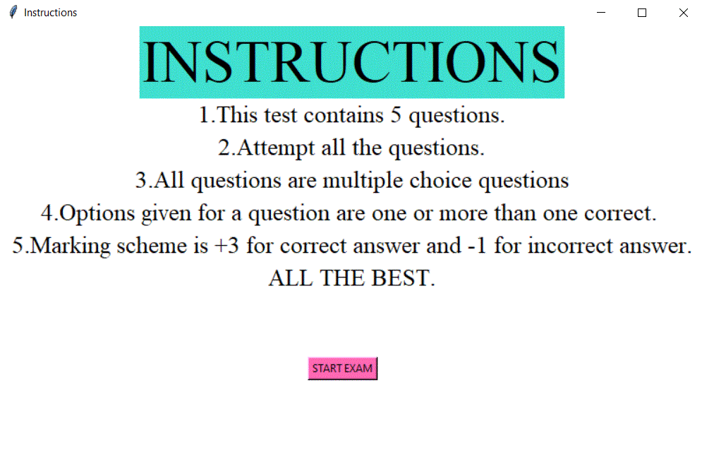
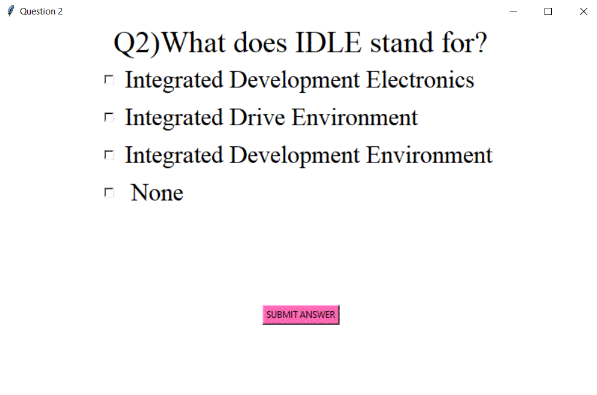
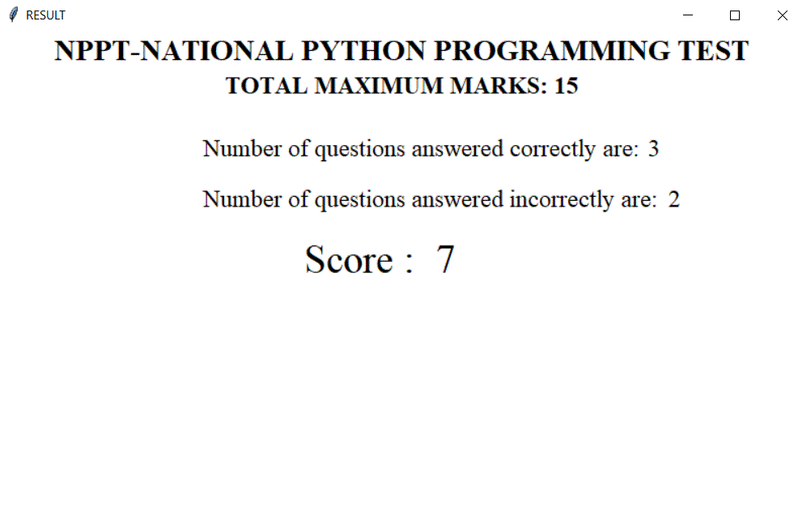

<!-- PROJECT LOGO -->
 

    <h1 align="center">MCQ Test</h1>
   
<i>
      Subject-Python Programming
      </i>
             
             
    

  

<!-- TABLE OF CONTENTS -->

  
Table of Contents

  <ol>
    <li>
      <a href="#about-the-project">About The Project</a>
      <li><a href="#built-with">Built With</a>
    <li><a href="#Key Features">Key Features</a>
    <li><a href="#screenshots">Screenshots</a></li>
    </ol>

<!-- ABOUT THE PROJECT -->
# About The Project
  

    

    This is a MCQ test comprising of 5 questions on Python Language.
     
    <b>Note: </b> This repository is for the purpose of Python Mini Project (SY - B.Tech Electronics, VJTI, Mumbai)
    

  

  
## Built With

<li>Python
<li>Tkinter
    
 ## Key Features
 
 <li>1)Sign In:
    Candidates will have to enter their registration ID to make sure that only registered candidates appearr for the exam.
<li>2)Negative Marking Scheme:
    Candidates will be awarded +3 for correct answer and -1 for incorrect answer.
<li>3)Immediate Display of Result:
    Candidate's score will be displayed on the screen immediately after they end up answering all the questions.Along with their scores,information about number of questions answered correctly and incorrectly will also be displayed.
    
    
    

<!-- USAGE EXAMPLES -->
# Screenshots

## Project Screenshots

  &nbsp; &nbsp; &nbsp; &nbsp; 

&nbsp; &nbsp; 

  

&nbsp; &nbsp; 

 

&nbsp; &nbsp; 

 

&nbsp; &nbsp; 

 

